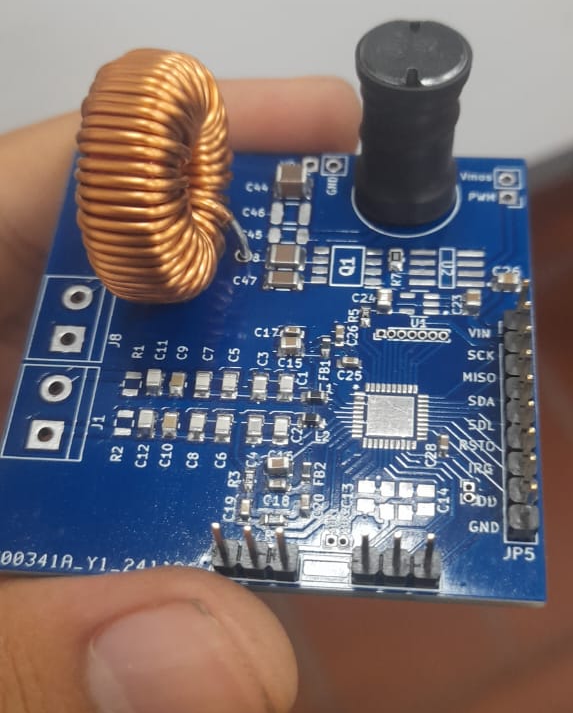

# Simultaneous Wireless Power Transfer and Near Field Communication (WPT + NFC)

This repository contains the electronic design and PCB files for the **“Simultaneous Wireless Power Transfer and Near Field Communication”** project, developed as a graduation project for the **Pontificia Universidad Javeriana Cali**.

---

## Project Description

This thesis presents the design and implementation of a system capable of integrating **Wireless Power Transfer (WPT)** and **Near Field Communication (NFC)** into the **PhenoAgro** platform, which is used for crop phenotyping in agricultural environments.

The proposal arises from the need to **replace the current metal connection system**, which faces durability and reliability issues under adverse environmental conditions.  
The new design allows for the **simultaneous transmission of power and data via inductive coupling**, reducing mechanical vulnerability and increasing the system's robustness.

---

## Project Images

### Functional Prototype  

### PCB Design

---

## Key Features

- **WPT + NFC Integration:** Simultaneous communication and power transfer via inductive coupling.  
- **Optimized Electromagnetic Design:** Parameters such as coupling coefficient, quality factor, skin effect, and proximity effect were considered.  
- **Efficient Power Circuits:** Implementation of compensations, Class E inverters, and high-efficiency rectifiers.  
- **Simulation and Validation:** Analysis using SPICE and HFSS tools, yielding experimental results exceeding **50% total power transfer efficiency**.  
- **Practical Application:** Compatible with agricultural IoT systems and high-demand environmental settings.  

---

## Tools and Technologies Used

- **PCB Design:** KiCad  
- **Electromagnetic Simulation:** Ansys HFSS  
- **Circuit Simulation:** LTSpice / Qspice  
- **Programming Languages:** Python, C  
- **Others:** ADS, MATLAB  

---

## Documentation
The complete report and detailed project simulations are available in this repository or can be consulted upon request.

---

## Author

**Jair Andrés Narváez Chamorro** Electronics Engineer — Pontificia Universidad Javeriana Cali  
📧 [jairandresnar@gmail.com](mailto:jairandresnar@gmail.com)  
🔗 [LinkedIn](https://www.linkedin.com/in/jair-andr%C3%A9s-narv%C3%A9z-chamorro-251324247/) | [GitHub](https://github.com/jairnarvaez)

---
